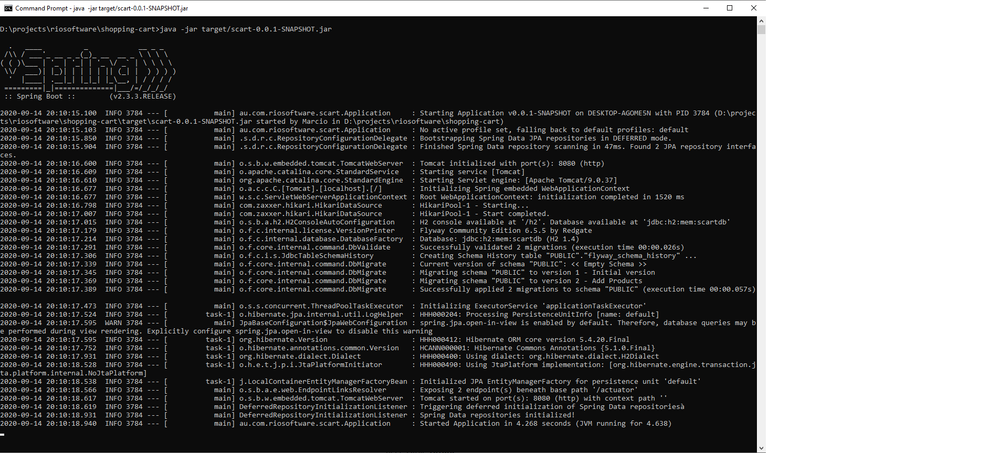
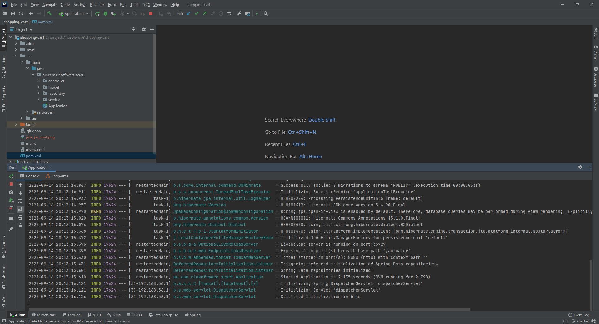
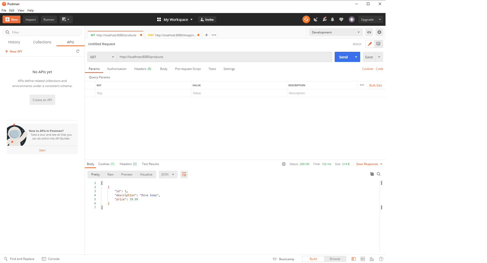
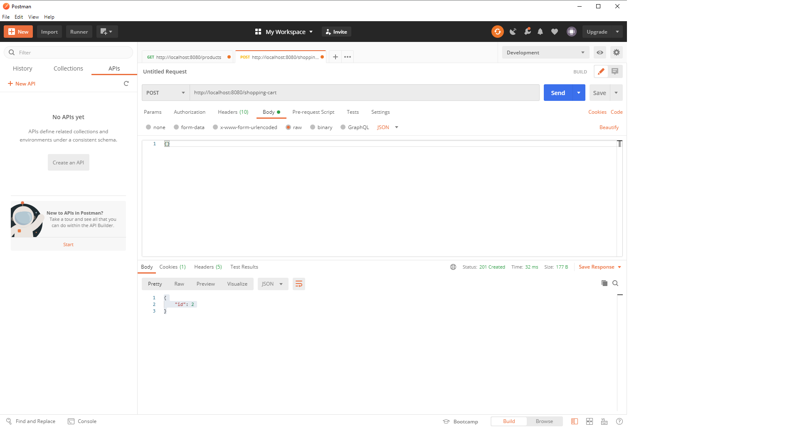
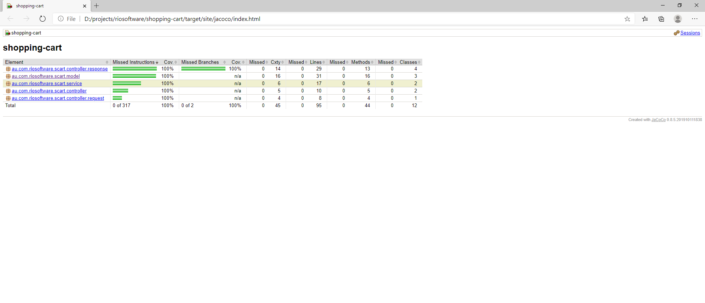
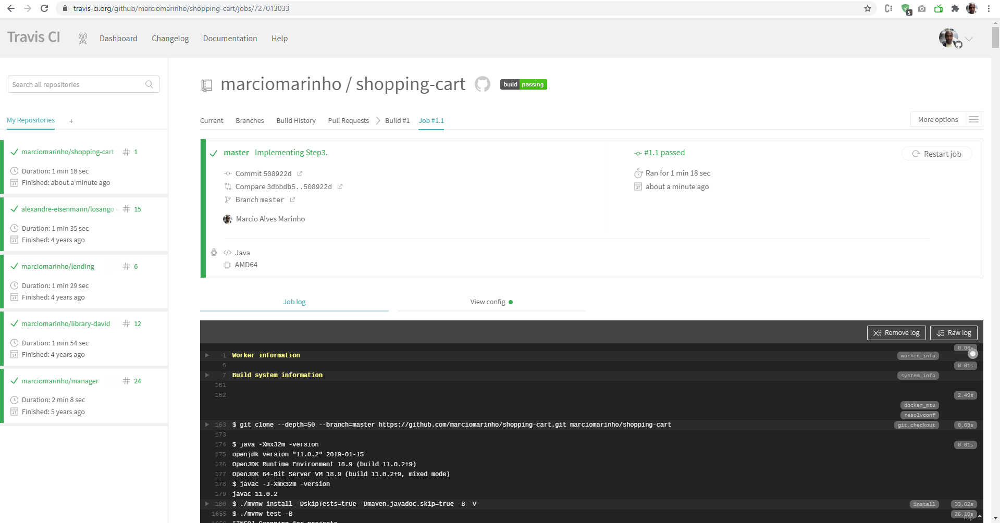

# Welcome to the Shopping Cart App

Hi,

This is the documentation for the Shopping Cart App challenge. 

My version number is : **68248247cd23ebffaa256f583e0e4ce05b4a0b86**

This application is a Spring Boot micro service, that will handle our shopping cart functionality.

The stack used:
* Java 11 ( AWS Correto Open JDK )
* Maven
* Spring Boot 2.3.3.RELEASE
* JUnit 5
* Mockito

## Running the application

Make sure you have a JDK 11 or above and maven configured in your local environment. If you don't, you can use the following links that will help you setup your localhost:
https://docs.aws.amazon.com/corretto/latest/corretto-11-ug/downloads-list.html
https://jdk.java.net/14/
https://maven.apache.org/install.html

After you have your environment set, just open a command shell and go to the application's folder and type:
* mvn clean package
* java -jar target/scart-0.0.1-SNAPSHOT.jar

You can also run:
* mvn spring-boot:run



Or even from your preferred IDE. Mine is IntelliJ :



This Spring Boot plugin will basically do the above steps and also run the application.

## Interacting with the Shopping Cart

Once the application is up and running we can interact with the application via its REST interface.

Let's get first a list of all products. For that, you only need to send a GET request.
You can use any tool for that, such as Postman, SoapUI or the command line curl.

* GET http://localhost:8080/products
```
[
   {
      "id":1,
      "description":"Dove Soap",
      "price":39.99
   }
]
```



We have one product, called "Dove Soap", which has id #1.

Create a new shopping cart, use a method POST with an empty body:
* POST http://localhost:8080/shopping-cart {}
```
{
  "id": 2
}
```



## Adding items to the cart

All we need is to send a PATCH request with the item and cart id.

* PATCH http://localhost:8080/shopping-cart {
                                                 "shoppingCartId": "2", 
                                                 "productId": "1", 
                                                 "quantity": "1"
                                             }
```
{
    "id": 2,
    "total": 39.99,
    "items": [
        {
            "id": 4,
            "product": {
                "id": 1,
                "description": "Dove Soap"
            },
            "price": 39.99
        }
    ]
}
```

Adding the Dove Soap 5 times will give us the following result:

```
{
    "id": 2,
    "total": 199.95,
    "items": [
        {
            "id": 4,
            "product": {
                "id": 1,
                "description": "Dove Soap"
            },
            "price": 39.99
        },
        {
            "id": 6,
            "product": {
                "id": 1,
                "description": "Dove Soap"
            },
            "price": 39.99
        },
        {
            "id": 8,
            "product": {
                "id": 1,
                "description": "Dove Soap"
            },
            "price": 39.99
        },
        {
            "id": 10,
            "product": {
                "id": 1,
                "description": "Dove Soap"
            },
            "price": 39.99
        },
        {
            "id": 12,
            "product": {
                "id": 1,
                "description": "Dove Soap"
            },
            "price": 39.99
        }
    ]
}
```

## Tests coverage

The application has a 100% test coverage, as seen on Jacoco report.



All classes have tests, but (IMHO) the most interesting one is definitely : **ShoppingCartControllerIntegrationTest** 

Green build on Travis CI: https://travis-ci.org/github/marciomarinho/shopping-cart

